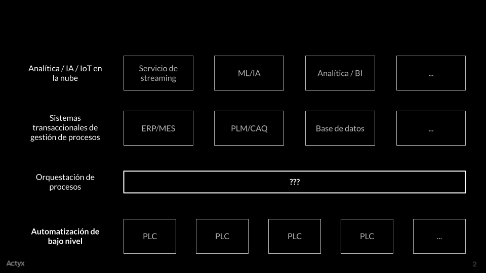
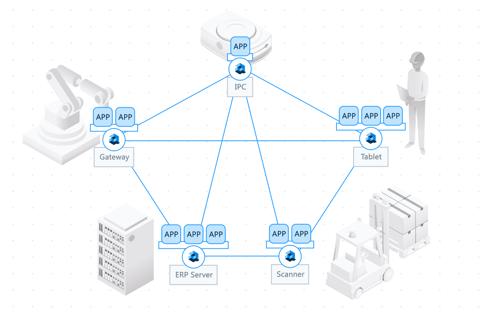
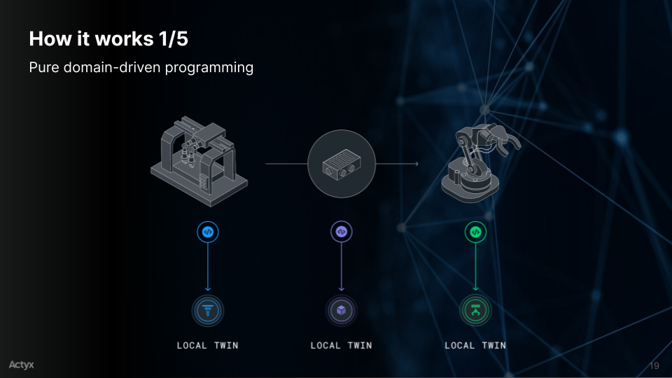
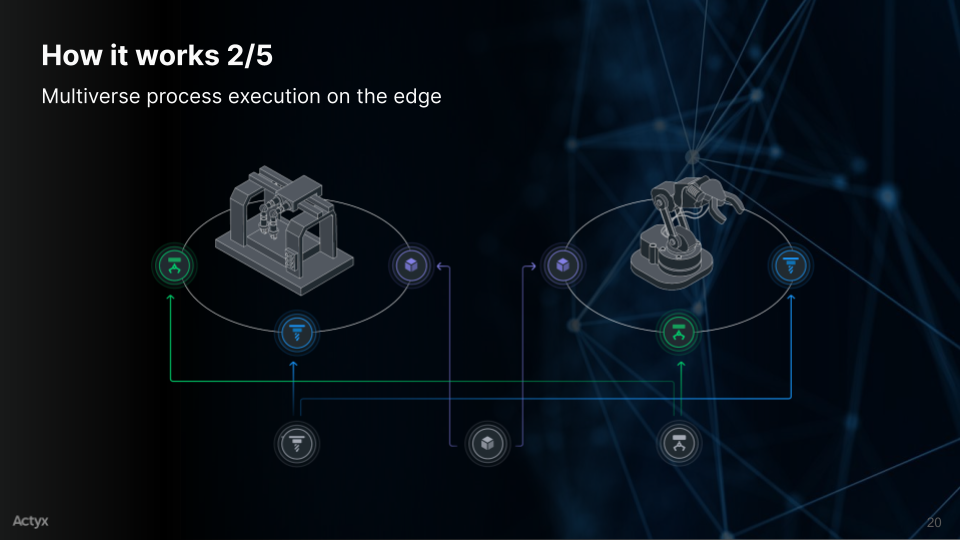
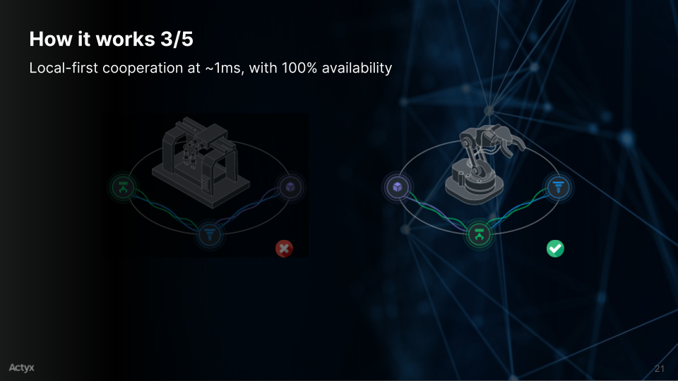
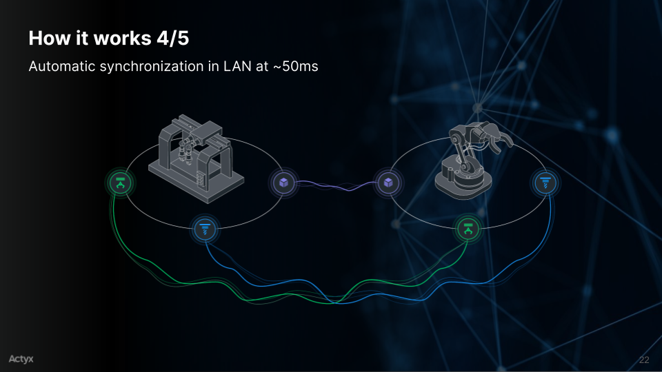
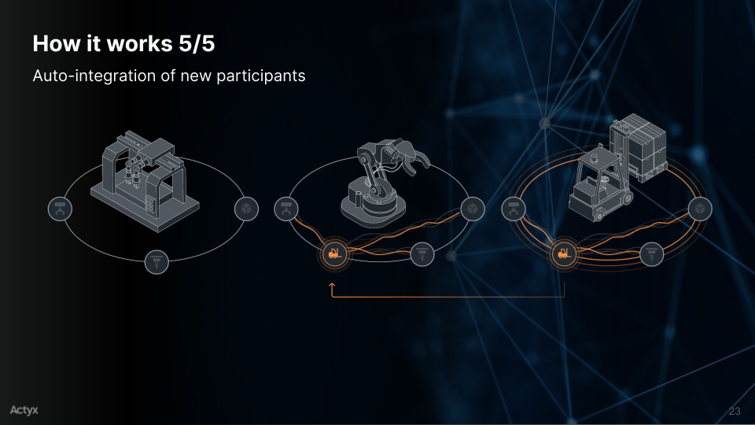
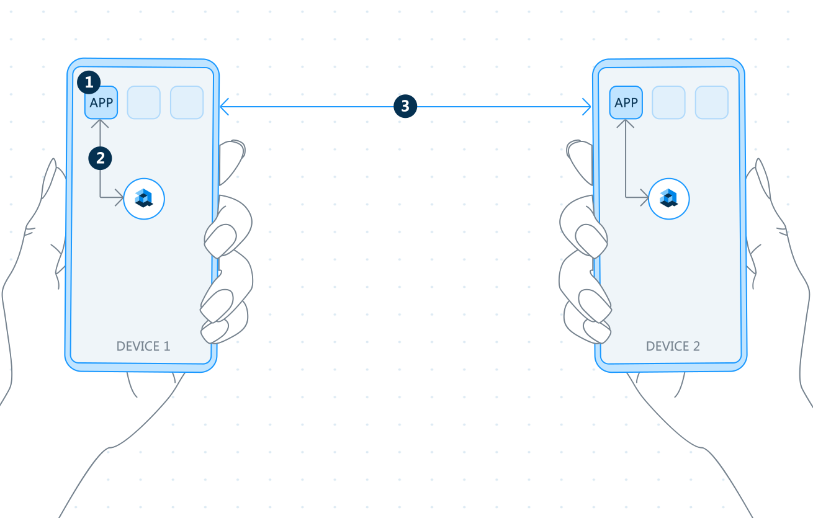
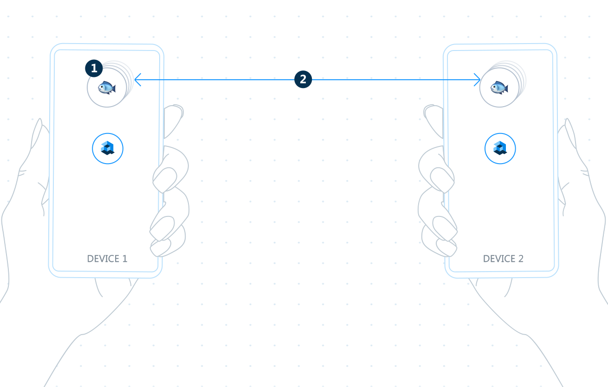

## IIoT: Industrial IoT

### Un enfoque local

^^^

## ¿Quién Soy?

Mario Camou

Senior SRE en Actyx AG (https://actyx.com)

^^^

## ¿Qué es IIoT?

 <!-- .element: class="fragment" data-fragment-index="2" -->

^^^

## ¿Por qué IIOT?

- PIB mundial: <!-- .element: class="fragment" data-fragment-index="2" --> **US$87,55 \* 10^12** <!-- .element: class="fragment" data-fragment-index="2" -->
- Manufactura: <!-- .element: class="fragment" data-fragment-index="3" --> **US$13,8 \* 10^12** <!-- .element: class="fragment" data-fragment-index="3" -->

En 2019, la manufactura generó <!-- .element: class="fragment" data-fragment-index="4" --> **16%**<!-- .element: class="fragment" data-fragment-index="4" --> del PIB mundial <!-- .element: class="fragment" data-fragment-index="4 " -->

^^

## ¿Por qué IIOT?

- <!-- .element: class="fragment" data-fragment-index="1" --> Reducción de tiempos <!-- .element: class="fragment" data-fragment-index="1" -->

  - Intralogística <!-- .element: class="fragment" data-fragment-index="2" -->
  - Corrección de errores (QA) <!-- .element: class="fragment" data-fragment-index="2" -->
  - Aprovechamiento de las máquinas <!-- .element: class="fragment" data-fragment-index="2" -->
  

- <!-- .element: class="fragment" data-fragment-index="3" --> Mejora de calidad <!-- .element: class="fragment" data-fragment-index="3" -->

  - Reducción de merma y defectos <!-- .element: class="fragment" data-fragment-index="4" -->
  - Mantenimento preventivo <!-- .element: class="fragment" data-fragment-index="4" -->
  

- <!-- .element: class="fragment" data-fragment-index="5" --> Planificación <!-- .element: class="fragment" data-fragment-index="5" -->

  - Reduccióñ de errores manuales <!-- .element: class="fragment" data-fragment-index="6" -->
  - Manufactura <!-- .element: class="fragment" data-fragment-index="6" --> _Just in Time_ <!-- .element: class="fragment" data-fragment-index="6" -->

^^^

## El Gemelo Digital (_Digital Twin_)

### ¿Qué es? <!-- .element: class="fragment" data-fragment-index="1" -->

- Identidad virtual del dispositivo <!-- .element: class="fragment" data-fragment-index="2" -->
- Puente entre el mundo de los átomos y el mundo de los datos <!-- .element: class="fragment" data-fragment-index="3" -->
- Representación virtual de un proceso, producto, servicio u objeto <!-- .element: class="fragment" data-fragment-index="4" -->

Note:

- puente entre el mundo real y el mundo virtual
- énfasis en "Gemelo"

^^

### El Gemelo Digital

_La visión final del gemelo digital es poder crear, verificar y construir nuestro equipo en un entorno virtual_

\-John Vickers, NASA

^^

### El Gemelo Digital

#### ¿Para qué se usa?

- Diseño de producto <!-- .element: class="fragment" data-fragment-index="2" -->
- Simulación <!-- .element: class="fragment" data-fragment-index="2" -->
- Optimización <!-- .element: class="fragment" data-fragment-index="2" -->
- Análisis de datos <!-- .element: class="fragment" data-fragment-index="2" -->
- Monitorización <!-- .element: class="fragment" data-fragment-index="2" -->
- Mantenimiento <!-- .element: class="fragment" data-fragment-index="2" -->

#### Elemento <!-- .element: class="fragment" data-fragment-index="3" --> **pasivo** <!-- .element: class="fragment" data-fragment-index="3" -->

^^

### El Gemelo Digital

#### Cloud

- \-- Latencia/rendimiento <!-- .element: class="fragment" data-fragment-index="2" -->
- \-- Caídas de la conexión <!-- .element: class="fragment" data-fragment-index="3" -->
- \-- Punto único de fallo <!-- .element: class="fragment" data-fragment-index="4" -->
- \-- Costo <!-- .element: class="fragment" data-fragment-index="5" -->

^^

### El Gemelo Digital

#### Edge

Cloud pero "más cerca" <!-- .element: class="fragment" data-fragment-index="2" -->

- \- Latencia/rendimiento <!-- .element: class="fragment" data-fragment-index="3" -->
- \-- Caídas de la conexión <!-- .element: class="fragment" data-fragment-index="4" -->
- \-- Punto único de fallo <!-- .element: class="fragment" data-fragment-index="5" -->
- \-- Costo <!-- .element: class="fragment" data-fragment-index="5" -->

^^

### El Gemelo Digital

#### On-site

- \- Latencia/rendimiento <!-- .element: class="fragment" data-fragment-index="2" -->
- \- Caídas de la conexión <!-- .element: class="fragment" data-fragment-index="3" -->
- \-- Punto único de fallo <!-- .element: class="fragment" data-fragment-index="4" -->
- \- Costo <!-- .element: class="fragment" data-fragment-index="5" -->

^^

### El Gemelo Digital

#### ¿Y si lo llevamos al límite?

^^^

_Lo que se ha hecho hasta ahora en IoT es antinatural. Es como separar el cerebro del cuerpo, y tener un sólo cerebro controlando cientos o miles de cuerpos_

\- Oliver Stollmann, CEO, Actyx AG

^^

### Local-first Cooperation

 <!-- .element: class="fragment" data-fragment-index="2" -->

^^

### Local-first Cooperation

¿Servidor? ¿Qué es eso? <!-- .element: class="fragment" data-fragment-index="2" -->

- <!-- .element: class="fragment" data-fragment-index="3" --> Modelo peer-to-peer <!-- .element: class="fragment" data-fragment-index="3" -->

- <!-- .element: class="fragment" data-fragment-index="5" --> Independiente de <!-- .element: class="fragment" data-fragment-index="5" -->

  - Capa de transporte <!-- .element: class="fragment" data-fragment-index="5" -->
  - Infraestructura <!-- .element: class="fragment" data-fragment-index="5" -->
  

- <!-- .element: class="fragment" data-fragment-index="6" --> Diferentes maneras de implementar <!-- .element: class="fragment" data-fragment-index="6" -->

  - Blockchain <!-- .element: class="fragment" data-fragment-index="7" -->
  - Event Sourcing <!-- .element: class="fragment" data-fragment-index="8" -->
  - ... <!-- .element: class="fragment" data-fragment-index="9" -->

Note: Example: Collaborative editing, why go to the cloud?
p2p Example: MMORPG vs. LAN Party
Android Wi-Fi Aware / Network Awareness Networking (8.0)

^^

### Local-first Cooperation

#### Event Sourcing

- Estado local, eventos distribuidos <!-- .element: class="fragment" data-fragment-index="2" -->
- Estado efímero, eventos persistentes <!-- .element: class="fragment" data-fragment-index="3" -->
- El estado se calcula a partir de los eventos <!-- .element: class="fragment" data-fragment-index="4" -->
- Almacena hechos, no interpretaciones <!-- .element: class="fragment" data-fragment-index="5" -->

_Los eventos son hechos. Los hechos molan porque los puedes grabar en una losa de piedra._ <!-- .element: class="fragment" data-fragment-index="6" -->

\- Roland Kuhn, CTO, Actyx <!-- .element: class="fragment" data-fragment-index="6" -->

^^

### Local-first Cooperation

#### Event Sourcing - ¿Por qué?

- Extensibilidad <!-- .element: class="fragment" data-fragment-index="2" -->
- Trazabilidad <!-- .element: class="fragment" data-fragment-index="3" -->
- Simulación a posteriori <!-- .element: class="fragment" data-fragment-index="4" -->
- Depuración y corrección de errores <!-- .element: class="fragment" data-fragment-index="5" -->

^^

### Local-first Cooperation

#### Event Sourcing - _Caveats_

- <!-- .element: class="fragment" data-fragment-index="2" --> Orden global de eventos <!-- .element: class="fragment" data-fragment-index="2" -->

  - ¿NTP? <!-- .element: class="fragment" data-fragment-index="3" --> _yeah, right!_ <!-- .element: class="fragment" data-fragment-index="3" -->
  - CRDTs <!-- .element: class="fragment" data-fragment-index="4" -->
  - Relojes virtuales <!-- .element: class="fragment" data-fragment-index="5" --> (_Lamport clocks_) <!-- .element: class="fragment" data-fragment-index="5" -->
  - Particiones y viajes en el tiempo <!-- .element: class="fragment" data-fragment-index="6" -->
  

- <!-- .element: class="fragment" data-fragment-index="7" --> Diseño de eventos <!-- .element: class="fragment" data-fragment-index="7" -->

  - ¿Tus eventos son realmente hechos? <!-- .element: class="fragment" data-fragment-index="8" -->
  

^^

### Local-first Cooperation

#### Event Sourcing - _Caveats_

- Migración de eventos

- <!-- .element: class="fragment" data-fragment-index="1" --> Almacenamiento a largo plazo <!-- .element: class="fragment" data-fragment-index="1" -->

  - Tiempo de arranque <!-- .element: class="fragment" data-fragment-index="1" -->
  - Espacio de almacenamiento <!-- .element: class="fragment" data-fragment-index="1" -->

^^

### Local-first Cooperation

#### _Content-Addressable Storage_

- Las entidades tienen nombres <!-- .element: class="fragment" data-fragment-index="2" -->
- ¿Cómo asignar un nombre sin una autoridad central? <!-- .element: class="fragment" data-fragment-index="3" -->
- El nombre de una entidad está dado por su contenido <!-- .element: class="fragment" data-fragment-index="4" -->

Note: Ejemplo: Git

^^^

### Gemelo local

#### ¿Qué es?

- <!-- .element: class="fragment" data-fragment-index="2" --> Gemelo digital distribuido <!-- .element: class="fragment" data-fragment-index="2" -->
  - Máquinas <!-- .element: class="fragment" data-fragment-index="3" -->
  - Procesos <!-- .element: class="fragment" data-fragment-index="3" -->
  - Materiales <!-- .element: class="fragment" data-fragment-index="3" -->
  - Productos <!-- .element: class="fragment" data-fragment-index="3" -->
  - Personas <!-- .element: class="fragment" data-fragment-index="3" -->
  - ... <!-- .element: class="fragment" data-fragment-index="3" -->

^^

### Gemelo local

#### ¿Cómo funciona?

  <!-- .element class="fragment"-->
  <!-- .element class="fragment"-->
  <!-- .element class="fragment"-->
  <!-- .element class="fragment"-->
  <!-- .element class="fragment"-->

^^

### Gemelo local

#### ¿Qué aporta?

- <!-- .element: class="fragment" data-fragment-index="2" --> Mínima latencia <!-- .element: class="fragment" data-fragment-index="2" -->

- <!-- .element: class="fragment" data-fragment-index="3" --> Tolerancia a fallos <!-- .element: class="fragment" data-fragment-index="3" -->

  - Del servidor <!-- .element: class="fragment" data-fragment-index="4" -->
  - De la conexión <!-- .element: class="fragment" data-fragment-index="4" -->
  - De los dispositivos <!-- .element: class="fragment" data-fragment-index="4" -->
  

- <!-- .element: class="fragment" data-fragment-index="5" --> Escalabilidad <!-- .element: class="fragment" data-fragment-index="5" -->

  ⟶ Puede actuar sobre el mundo real <!-- .element: class="fragment" data-fragment-index="6" -->

- <!-- .element: class="fragment" data-fragment-index="7" --> Extensibilidad <!-- .element: class="fragment" data-fragment-index="7" -->

Note: Ejemplos: Fallos de conexión (Wi-Fi Aware), ATV (actuar sobre el mundo real), manufactura e infralogística (extensibilidad)

^^

### Gemelo local

#### Operaciones

- <!-- .element: class="fragment" data-fragment-index="2" --> Todo son eventos <!-- .element: class="fragment" data-fragment-index="2" -->

  - <!-- .element: class="fragment" data-fragment-index="3" --> Configuración <!-- .element: class="fragment" data-fragment-index="3" -->
  - <!-- .element: class="fragment" data-fragment-index="4" --> Monitorización <!-- .element: class="fragment" data-fragment-index="4" -->
  - <!-- .element: class="fragment" data-fragment-index="5" --> Logs <!-- .element: class="fragment" data-fragment-index="5" -->

    ⟶ Funciona incluso con dispositivos offline <!-- .element: class="fragment" data-fragment-index="6" -->

  - <!-- .element: class="fragment" data-fragment-index="6" --> Debugging <!-- .element: class="fragment" data-fragment-index="7" -->
  - <!-- .element: class="fragment" data-fragment-index="7" --> Análisis de rendimiento <!-- .element: class="fragment" data-fragment-index="8" -->

^^

### Gemelo local

#### ¿Cómo se desarrolla con Actyx?

  <!-- .element class="fragment"-->
  <!-- .element class="fragment"-->

^^

### Gemelo local

#### Retos

- Diseño del sistema (Event Sourcing) <!-- .element: class="fragment" data-fragment-index="2" -->
- Sincronización entre gemelos (Particiones) <!-- .element: class="fragment" data-fragment-index="3" -->
- Interacción con el mundo legacy <!-- .element: class="fragment" data-fragment-index="4" -->
- Almacenamiento a largo plazo <!-- .element: class="fragment" data-fragment-index="5" -->

^^^

## Q & A

^^^

## Gracias

#### Mario Camou

mario@actyx.io
https://github.com/mcamou
Twitter: @thedoc

https://www.local-first-cooperation.org/

https://developer.actyx.com
https://github.com/Actyx
